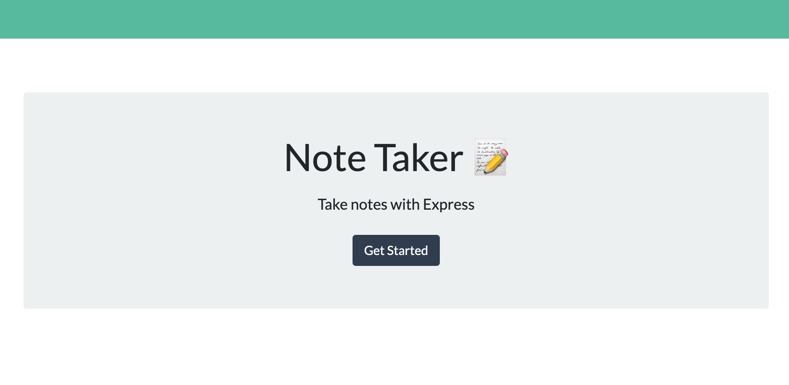
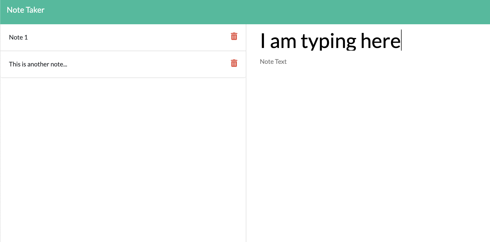

# NoteMaker

A task management tool with the capability to create and delete notes.

## Motivation

Life is changing rapidly thanks to COVID-19, and people need a way to stay on top of things.  NoteMaker is an online application that enables users to create notes, review their lists and delete itemsonce completed.

## Installation
As this application runs in Node and Express, users will need to run a NPM install in the commasnd line. The program is started with 'node server.js'.

## How to use?
Open the NoteTaker home page and start typing!  Use the disk icon to save an entry and the rubbish bin icon to delete one.

## Contribution
Git pull